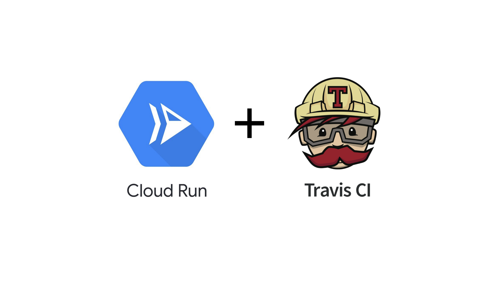

# Google Cloud Run + Travis CI

This repository shows how to use [Travis CI][tr] to build a container image and
deploy it to [Google Cloud Run][run] when you push a new commit.

[tr]: https://www.travis-ci.com/
[run]: https://cloud.google.com/run



### Table of Contents

<!--
  ⚠️ DO NOT UPDATE THE TABLE OF CONTENTS MANUALLY ️️⚠️
  run `npx markdown-toc -i README.md`
-->

<!-- toc -->

- [Step 0: Fork this repository](#step-0-fork-this-repository)
- [Step 1: Sign up to Travis CI](#step-1-sign-up-to-travis-ci)
- [Step 1: Install required tools](#step-1-install-required-tools)
- [Step 2: Create a service account for deploying](#step-2-create-a-service-account-for-deploying)
- [Step 3: Assign permissions to the service account](#step-3-assign-permissions-to-the-service-account)
- [Step 4: Encrypt the service account key](#step-4-encrypt-the-service-account-key)
- [Step 5: Configure your project ID](#step-5-configure-your-project-id)
- [Step 6: Commit the changes to your fork](#step-6-commit-the-changes-to-your-fork)
- [Step 7: View build result](#step-7-view-build-result)
- [Step 8: Clean up](#step-8-clean-up)

<!-- tocstop -->

## Step 0: Fork this repository

1. Scroll up and click **"Fork"** so you can try pushing commits and testing
builds.
0. **Clone** the repository on your machine.
0. Go to the `cloud-run-travisci` directory you cloned.

## Step 1: Sign up to Travis CI

Sign up at [www.travis-ci.com][tr] and enable **Travis CI** app on your forked
`cloud-run-travisci` repository at
https://www.travis-ci.com/account/repositories.

> Note: If you have an travis-ci<b>.org</b> account instead of .com, replace
> `--pro` arguments in this tutorial with `--org`.

## Step 1: Install required tools

- Google Cloud SDK (`gcloud`): https://cloud.google.com/sdk

- `travis` command-line tool:

    ```sh
    sudo gem install travis
    ```

    ```sh
    travis login --pro # (use --org if you're on travis-ci.ORG and not .COM)
    ```

## Step 2: Create a service account for deploying

To authenticate to GCP APIs from Travis CI build environment you will need a
[service
account](https://cloud.google.com/iam/docs/understanding-service-accounts).

```sh
PROJECT_ID="$(gcloud config get-value project -q)" # fetch current GCP project ID
```

```sh
SVCACCT_NAME=travisci-deployer # choose name for service account
```

Create a service account:

```sh
gcloud iam service-accounts create "${SVCACCT_NAME?}"
```

Find the email address of this account:

```sh
SVCACCT_EMAIL="$(gcloud iam service-accounts list \
  --filter="name:${SVCACCT_NAME?}@"  \
  --format=value\(email\))"
```

Create a JSON key to authenticate as this service account, and save it as
`google-key.json`:

```sh
gcloud iam service-accounts keys create "google-key.json" \
   --iam-account="${SVCACCT_EMAIL?}"
```

## Step 3: Assign permissions to the service account

You need to give these IAM roles to the service account created:

1. **Storage Admin:** Used for pushing docker images to Google Container
   Registry (GCR).
2. **Cloud Run Admin:** Used for deploying services to Cloud Run.
3. **IAM Service Account user:** Required by Cloud Run to be able to "act as"
   the runtime identity of the Cloud Run application (in this case, our deployer
   service account needs to able to "act as" the GCE default service account).

```sh
gcloud projects add-iam-policy-binding "${PROJECT_ID?}" \
   --member="serviceAccount:${SVCACCT_EMAIL?}" \
   --role="roles/storage.admin"
```

```sh
gcloud projects add-iam-policy-binding "${PROJECT_ID?}" \
   --member="serviceAccount:${SVCACCT_EMAIL?}" \
   --role="roles/run.admin"
```

```sh
gcloud projects add-iam-policy-binding "${PROJECT_ID?}" \
   --member="serviceAccount:${SVCACCT_EMAIL?}" \
   --role="roles/iam.serviceAccountUser"
```

## Step 4: Encrypt the service account key

Run the following command

```sh
travis encrypt-file --pro google-key.json
```

This command will print an `openssl [...]` command, **don’t lose it!**

Edit the `.travis.yml` file, and add this commmand to the `before_install` step:

```diff
 before_install:
-- echo REMOVE_ME # replace with the openssl command from "travis encrypt-file"
+- openssl aes-256-cbc -K $encrypted_fbfaf42b268c_key -iv $encrypted_fbfaf42b268c_iv -in google-key.json.enc -out google-key.json -d
 - curl https://sdk.cloud.google.com | bash > /dev/null
 ...
```

## Step 5: Configure your project ID

Edit the `.travis.yml` and configure the environment variables under the `env:`
key (such as `GCP_PROJECT_ID`, `IMAGE`, and `CLOUD_RUN_SERVICE`).

## Step 6: Commit the changes to your fork

:warning: Do not add `google-key.json` file to your repository as it can be
reached by others.

Make a commit, and push the changes to your fork:

```sh
git add google-key.json.enc .travis.yml
```

```sh
git commit -m "Enable Travis CI"
```

```sh
git push -u origin master
```

## Step 7: View build result

Go to [www.travis-ci.com][tr] and view your build results.

There might be errors that require you to fix.

If the build succeeds, the output of `gcloud run beta deploy` command will show
you the URL your app is deployed on! Visit the URL to see if the application
works!

```
[...]
Deploying container to Cloud Run service [example-app] in project [...] region [us-central1]
Deploying new service...
Setting IAM Policy.....done
Creating Revision......done
Routing traffic........done
Done.
Service [example-app] revision [example-app-00001] has been deployed
and is serving traffic at https://example-app-pwfuv4g72q-uc.a.run.app
```


## Step 8: Clean up

Delete the service account you created:

```sh
gcloud iam service-accounts delete "${SVCACCT_EMAIL?}"
```

Delete the Cloud Run application you deployed:

```sh
gcloud beta run services delete "YOUR-APP-NAME"
```

----

👍**Did this tutorial work for you?** Click "✭Star" on the top right of this
page and let me know!
